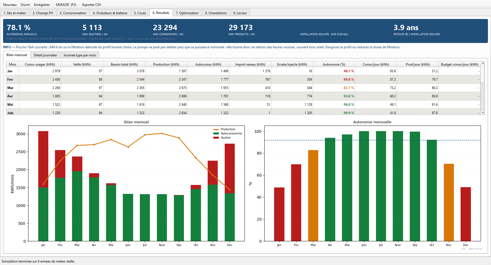
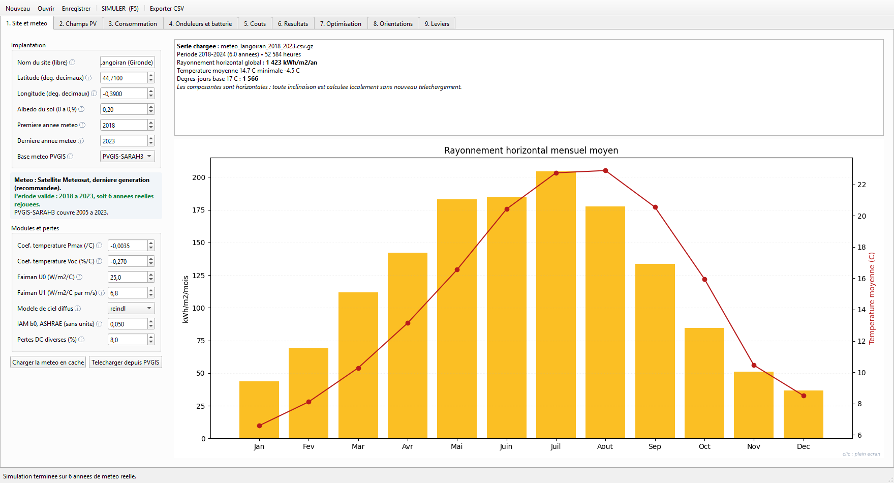
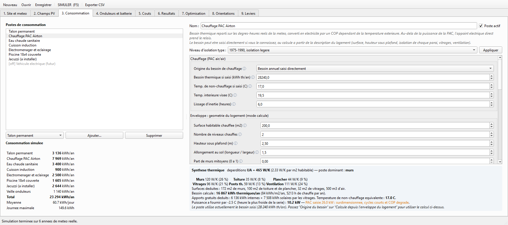
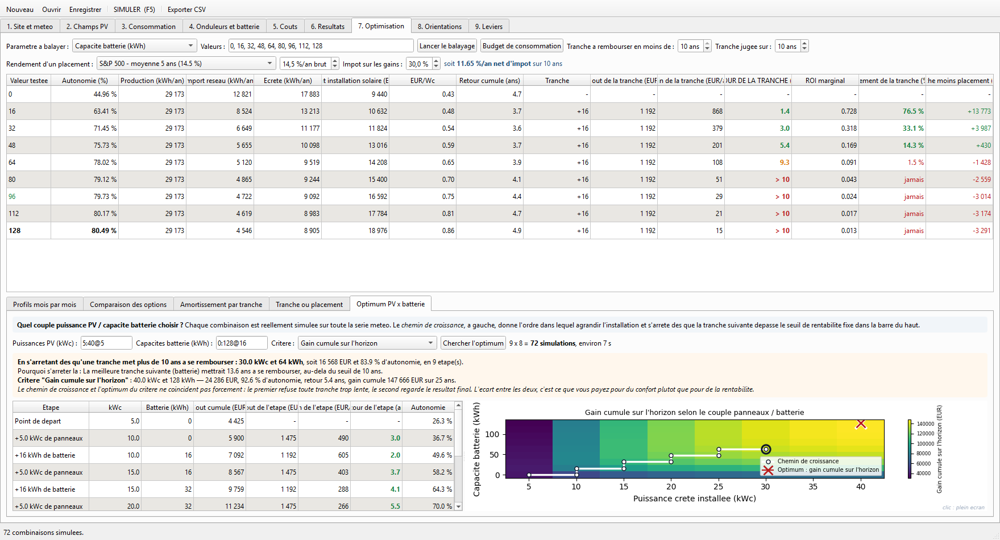
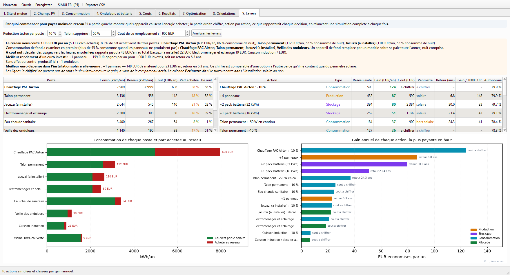

<div align="center">


# Plein Sud

**Simulateur photovoltaïque + batterie, au pas horaire, sur météo réelle.**

[](https://github.com/Pataclop/plein-sud/actions/workflows/tests.yml)
[](https://github.com/Pataclop/plein-sud/releases/latest)
[](LICENSE)

</div>

Vous hésitez entre 20 et 30 kWc, entre 32 et 96 kWh de batterie, entre 30 et
60 degrés d'inclinaison ? **Plein Sud** rejoue votre installation **heure par
heure sur six années de météo satellite réelle** et vous dit ce qu'elle produit,
ce qu'elle couvre, ce qu'elle coûte, et en combien de temps elle se rembourse.



---

## Installation

### L'application toute prête

Dernière version dans **[Releases](https://github.com/Pataclop/plein-sud/releases/latest)** :

| Système | Fichier |
|---|---|
| **Windows** | `PleinSud-windows.exe` — double-cliquez, rien à installer |
| **macOS** (Apple Silicon) | `PleinSud-macos-arm64.zip` — dézippez, glissez l'app dans *Applications* |

> Les exécutables ne sont pas signés. Sous macOS, faites un clic droit →
> *Ouvrir* au premier lancement ; sous Windows, *Informations complémentaires* →
> *Exécuter quand même*.
>
> Sur un Mac Intel, lancez depuis les sources : GitHub n'alloue plus de machines
> de build Intel.

### Depuis les sources

```bash
git clone https://github.com/Pataclop/plein-sud.git
cd plein-sud
pip install -r requirements.txt
python main.py
```

Python 3.11 ou plus. Trois dépendances : PyQt6, matplotlib, numpy.

---

## Les neuf onglets

### 1. Site et météo

Coordonnées, années, base PVGIS. Six années horaires de Langoiran sont livrées
avec le dépôt ; pour un autre lieu, un bouton télécharge la série et la met en
cache. Le rayonnement est stocké **sur plan horizontal** : changer une
inclinaison est ensuite instantané et hors ligne.



### 2. Champs PV

Un groupe de panneaux par ligne : nombre, Wc unitaire, inclinaison, azimut,
ombrage. Le productible de chaque groupe est recalculé à chaque simulation, et
le compteur kWc par onduleur passe au rouge en cas de dépassement.

### 3. Consommation

Vos postes, un par un : talon permanent, chauffage par pompe à chaleur, eau
chaude, piscine, spa, véhicule électrique, usages génériques. Les postes
thermiques réagissent à la météo réelle de chaque année — un hiver doux et un
hiver froid ne donnent pas le même résultat.



### 4. Onduleurs et batterie

Rendements, écrêtage, profondeur de décharge, régimes C, puissance souscrite,
recharge optionnelle en heures creuses. Et la courbe d'état de charge sur toute
la série horaire.

### 5. Coûts

Votre nomenclature, ligne par ligne, rangée en **deux périmètres** : ce qui
produit l'électricité (panneaux, onduleurs, batterie, câblage, pose) et ce qui
réduit le besoin (chauffe-eau, isolation). Seul le premier sert à juger le
dimensionnement, et donne les €/Wc comparables à un devis d'installateur.

### 6. Résultats

Bilan mensuel, détail jour par jour, journée moyenne de chaque mois. Autonomie,
kWh soutirés, coût annuel, temps de retour.

### 7. Optimisation

Balayez un paramètre et voyez **ce que rapporte chaque tranche prise seule** :
sur la configuration d'exemple, le premier pack de batterie se rembourse en
1,4 an, le cinquième jamais. C'est le critère d'arrêt que le temps de retour
global masque. Un sous-onglet cherche l'**optimum puissance PV × batterie** et
donne l'ordre dans lequel agrandir.



### 8. Orientations

Cherche l'inclinaison et l'azimut de chaque groupe selon le critère de votre
choix, avec la carte du critère groupe par groupe.

### 9. Leviers

Par quoi commencer pour payer moins de réseau ? L'énergie achetée est imputée à
chaque appareil, puis chaque action envisageable — un panneau de plus, un pack
de batterie, un poste allégé de 10 %, un usage décalé au soleil — est réellement
simulée et classée par gain annuel, coût et temps de retour.



---

## En ligne de commande

```bash
python main.py --cli                                # rapport texte complet
python main.py --sweep inclinaison 20,30,40,50,60   # balayage d'un paramètre
python main.py --grille 5:40@5 0:128@16 10          # optimum PV × batterie
python main.py --download 45.76 4.83 2018 2023      # nouvelle météo PVGIS
```

Le moteur est indépendant de l'interface : `pv_sizer.simulation.simulate(cfg, meteo)`
renvoie un dictionnaire complet, utilisable dans vos propres scripts.

---

## Pour aller plus loin

- **[Le modèle en détail](docs/modele.md)** — chaîne de calcul solaire, profils
  de consommation, dispatch horaire, hypothèses économiques, limites connues.
- `config_defaut.json` sert d'exemple : 22 kWc, 64 kWh de LFP, une maison en
  Gironde avec pompe à chaleur, piscine et spa. Partez de là, remplacez par vos
  chiffres, enregistrez votre propre fichier.

## Tests

```bash
pip install pytest
pytest -q
```

## Licence

MIT — voir [LICENSE](LICENSE).
Données météo : [PVGIS](https://re.jrc.ec.europa.eu/pvg_tools/fr/), Commission
européenne (JRC).
